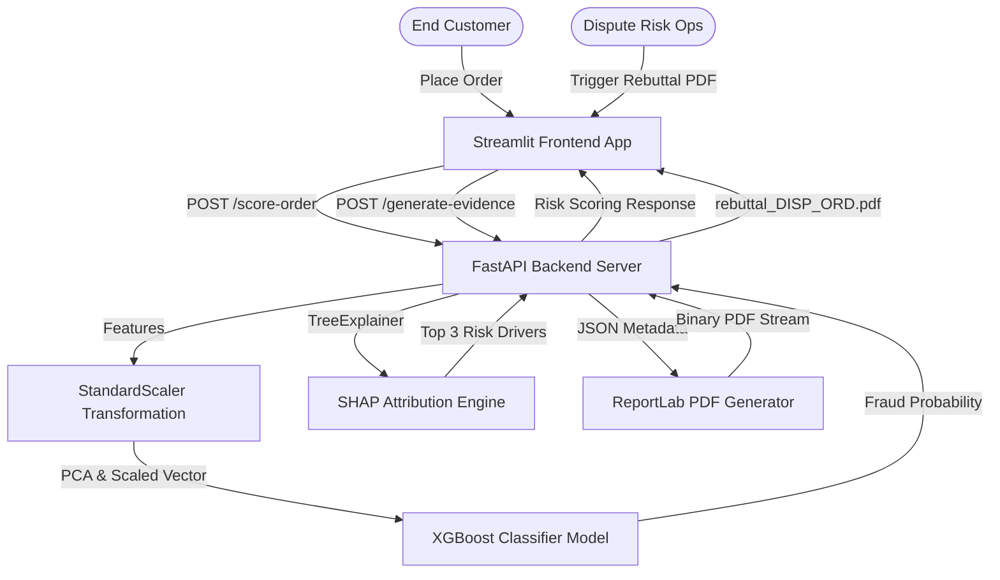

# System Architecture: RazorPay FraudGuard & Dispute Engine

This document outlines the high-level system design, directory structure, core components, data flow dynamics, and technology choices for the RazorPay FraudGuard & Dispute Engine.

---

## 1. System Overview

The **RazorPay FraudGuard & Dispute Engine** is a high-performance, real-time transaction risk scoring and chargeback mitigation application. It operates in two core domain modules:
1. **Real-Time Fraud Prevention**: Evaluates incoming transaction payloads against a calibrated machine learning classifier (XGBoost) and uses SHAP TreeExplainer to attribute exact margin risk contribution per-feature.
2. **Automated Dispute Representment**: Consolidates gateway authorizations, customer verification data (IP, 3DS, AVS), and shipping carrier logistics into formal Visa/Mastercard-compliant rebuttal PDF packages.

---

## 2. Directory Structure

The project codebase is organized as follows:

*   **`app/`**: Core FastAPI backend application module.
    *   [`__init__.py`](file:///c:/Users/yuvra/Coding%20Projects/RazorPay/app/__init__.py): Package initialization.
    *   [`main.py`](file:///c:/Users/yuvra/Coding%20Projects/RazorPay/app/main.py): FastAPI entry point, exposing scoring and representment endpoints.
    *   [`schemas.py`](file:///c:/Users/yuvra/Coding%20Projects/RazorPay/app/schemas.py): Pydantic validation schemas defining request/response structures.
    *   [`pdf_generator.py`](file:///c:/Users/yuvra/Coding%20Projects/RazorPay/app/pdf_generator.py): Document template engine generating Visa/Mastercard compliant dispute representment packets.
*   **`frontend/`**: Interactive user interface layer.
    *   [`app.py`](file:///c:/Users/yuvra/Coding%20Projects/RazorPay/frontend/app.py): Streamlit dashboard with transaction simulation, dispute queue visualizers, and governance dashboards.
*   **`tests/`**: Unit and integration test suites.
*   **`model.joblib`**: Serialized XGBoost machine learning classifier.
*   **`scaler.joblib`**: Serialized StandardScaler object for Time & Amount scaling.
*   **`metrics.json`**: Model performance statistics, optimal decision thresholds, ROI evaluations, and global SHAP importances.
*   **`fraud_pipeline.py`**: Model training, CV threshold calibration, cost-sensitive ROI assessment, and global SHAP importance computation.

---

## 3. High-Level Architecture & Components

### 3.1. Streamlit Frontend App
*   Exposes a responsive, light-themed fintech-style interface.
*   **Checkout Simulator**: Interactively tests legitimate, borderline, and high-risk payloads.
*   **Dispute Queue & Auto-Responder**: Features a list of mock disputes, allows selective representment, and renders live PDF inline frames.
*   **Governance & Audit Log**: Highlights policy boundaries, performance metrics, financial savings math, and global feature rankings.

### 3.2. FastAPI Backend
*   Asynchronous REST API framework loading ML artifacts lazily upon startup via a startup lifespan hook.
*   Enforces strong type validation via Pydantic model configurations.
*   Exposes:
    *   `GET /health`: Engine status check and decision threshold parameters.
    *   `POST /score-order`: Low-latency transaction evaluations.
    *   `POST /generate-evidence`: ReportLab PDF compilation and download stream response.

### 3.3. ML Model & Explainer
*   **XGBoost Classifier**: Stratified 80/20 train-test model calibrated utilizing a 5-fold cross-validation scheme to handle severe class imbalance (0.17% fraud rate).
*   **Optimal Threshold Calibration**: Maximizes recall while strictly enforcing precision >= 88%.
*   **SHAP TreeExplainer**: Explains local predictions on-the-fly to pinpoint the top 3 marginal risk-enhancing or risk-reducing features.

### 3.4. PDF Rebuttal Engine
*   ReportLab library compiles document templates flowable by flowable.
*   Draws professional slate/blue borders, tables, and badge elements representing merchant details, address verification codes (AVS), carrier signatures, and 3-D Secure status codes.

---

## 4. Key Data Flows

### Flow 1: Transaction Scoring & SHAP Attribution
1. Client submits transaction fields (`order_id`, `amount`, `time`, `v1` to `v28`) to `/score-order`.
2. FastAPI scales `time` and `amount` using the cached standard scalers.
3. A 30-feature vector is passed to the XGBoost classifier's `predict_proba()` method.
4. The raw probability is categorized into policy risk tiers:
    *   `>= 85.0%`: **Critical Risk** -> Automated Action: `DECLINE_AND_BLOCK`
    *   `>= 0.6723` (calibrated threshold): **High Risk** -> Automated Action: `MANUAL_REVIEW_OR_3DS`
    *   `>= 30.0%`: **Medium Risk** -> Automated Action: `CHALLENGE_3DS`
    *   `< 30.0%`: **Low Risk** -> Automated Action: `APPROVE_INSTANT`
5. The feature vector is passed to the SHAP explainer to isolate the three features with the highest absolute SHAP values.
6. Returns probability, risk tier, action, and top 3 drivers.

### Flow 2: Dispute Evidence Retrieval & PDF Rebuttal Generation
1. Administrator selects an active dispute case (e.g. `DISP-2026-8819`).
2. Client sends dispute metadata, fulfillment records, verification parameters, and authorization details to `/generate-evidence`.
3. ReportLab dynamically formats these details into tables, inserts verification validation tags, and appends a formal rebuttal statement.
4. Output is serialized into an in-memory binary buffer (`io.BytesIO()`) and streamed back to the client as an attachment.

---

## 5. Technology Stack & Core Dependencies

| Component | Library/Tool | Rationale |
| :--- | :--- | :--- |
| **API Framework** | FastAPI + Uvicorn | High concurrency, automatic Swagger doc generation, type-safe validation. |
| **UI Dashboard** | Streamlit | Rapid frontend generation for data-driven analytics and operational queues. |
| **Machine Learning** | XGBoost + scikit-learn | State-of-the-art classifier performance on structured, highly imbalanced data. |
| **Explainability** | SHAP | Game-theoretic mathematical guarantees for feature attribution consistency. |
| **Document Generation**| ReportLab | Programmatic PDF layout customization with sub-second execution speeds. |
| **Visualization** | Plotly Express | Interactive charts (risk gauges and SHAP waterfall representations). |

---

## 6. Compliance, Security & Performance

*   **PCI Compliance**: Card details are truncated to last 4 digits (`card_last4`). No raw primary account numbers (PAN) are ingested or stored.
*   **Sub-second Latency**: The scoring pipeline performs feature scaling and XGBoost inference in under **30 ms**, fulfilling critical checkout requirements.
*   **Cryptographic Tokens**: Uses EMVCo network tokenization flags (`network_token_used`) to prove cryptographic liability shift credentials to network issuers.
