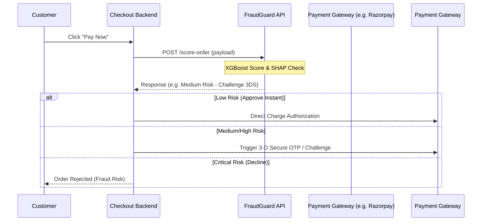

# Integration Guide: Connecting to Real Data

This guide details the technical steps and provides code blueprints for transitioning the **RazorPay FraudGuard & Dispute Engine** from mock visual simulation to a live, production payment infrastructure.

---

## 1. Real-Time Transaction Scoring Stream

In a production environment, transactions should be scored inline *before* authorization or immediately after a checkout request is initiated.

### 1.1 Webhook / API Scoring Architecture
You can place the scoring engine as a middleware or interceptor in your payment checkout flow.



### 1.2 Python Blueprint: Scoring Middleware Interceptor
Here is how to intercept checkout transactions and score them before completing authorizations:

```python
import httpx
from fastapi import FastAPI, Request, HTTPException

app = FastAPI()
FRAUD_GUARD_URL = "http://localhost:8000/score-order"

@app.post("/checkout")
async def checkout(order_payload: dict):
    # 1. Map production checkout data to TransactionRequest schema
    score_payload = {
        "order_id": order_payload.get("id"),
        "time": order_payload.get("time_elapsed_since_day_start"),
        "amount": float(order_payload.get("amount")),
        # In a real environment, PCA components (V1-V28) can be replaced by 
        # actual features or calculated transaction aggregates:
        "v1": order_payload.get("velocity_last_1h", 0.0),
        "v2": order_payload.get("ip_country_match", 1.0),
        # ...
        "v14": order_payload.get("card_age_days", 30.0)
    }

    # 2. Call FraudGuard REST endpoint
    async with httpx.AsyncClient() as client:
        resp = await client.post(FRAUD_GUARD_URL, json=score_payload, timeout=2.0)
        if resp.status_code != 200:
            # Fallback policy: allow checkout if scoring engine is down (fail-open)
            return {"status": "authorized", "review": "fail-open"}
            
        scoring_result = resp.json()

    # 3. Apply Decision Routing Rules
    action = scoring_result.get("decision_action")
    if action == "DECLINE_AND_BLOCK":
        raise HTTPException(status_code=400, detail="Transaction declined by risk engines.")
    elif action == "CHALLENGE_3DS":
        return {"status": "require_3ds_verification", "score": scoring_result}
    
    # Low risk -> proceed to instant capture
    return {"status": "authorized", "score": scoring_result}
```

---

## 2. Gateway Dispute Evidence Integrations

To automate representment, you must consume webhooks from your payment gateways (e.g. Razorpay, Stripe) to trigger dispute workflows, and query their APIs to fetch chargeback metadata.

### 2.1 Webhook Subscriptions
Subscribe to gateway dispute events:
*   **Razorpay**: `dispute.created`, `dispute.lost`, `dispute.won`
*   **Stripe**: `charge.dispute.created`, `charge.dispute.funds_reinstated`

### 2.2 Python Blueprint: Fetching Evidence from Gateways
When a dispute webhook fires, call the gateway APIs to retrieve verification, customer, and transaction details:

```python
import razorpay
import stripe

# Razorpay Integration
def fetch_razorpay_dispute_evidence(dispute_id: str, api_key: str, api_secret: str) -> dict:
    client = razorpay.Client(auth=(api_key, api_secret))
    
    # Retrieve dispute details
    dispute = client.dispute.fetch(dispute_id)
    payment_id = dispute.get("payment_id")
    
    # Retrieve payment and audit trails
    payment = client.payment.fetch(payment_id)
    
    return {
        "dispute_id": dispute["id"],
        "order_id": payment.get("order_id"),
        "amount": payment["amount"] / 100.0, # Convert paisa/cents to currency unit
        "currency": payment["currency"],
        "card_brand": payment.get("card_brand"),
        "card_last4": payment.get("last4"),
        "three_ds_status": "Y" if payment.get("international") else "Y - Frictionless 3DS",
        "avs_result": payment.get("description", "Match"),
        "customer_name": payment.get("email").split("@")[0].upper(),
        "customer_email": payment.get("email"),
        "customer_phone": payment.get("contact"),
        "auth_code": payment.get("acquirer_data", {}).get("auth_code", "AUTH_APPROVED")
    }

# Stripe Integration
def fetch_stripe_dispute_evidence(dispute_id: str, api_key: str) -> dict:
    stripe.api_key = api_key
    dispute = stripe.Dispute.retrieve(dispute_id)
    charge = stripe.Charge.retrieve(dispute["charge"])
    
    return {
        "dispute_id": dispute["id"],
        "order_id": charge["metadata"].get("order_id"),
        "amount": dispute["amount"] / 100.0,
        "currency": dispute["currency"].upper(),
        "card_brand": charge["payment_method_details"]["card"]["brand"],
        "card_last4": charge["payment_method_details"]["card"]["last4"],
        "three_ds_status": charge["payment_method_details"]["card"]["three_d_secure"],
        "avs_result": charge["payment_method_details"]["card"]["checks"]["address_line1_check"],
        "customer_name": charge["billing_details"]["name"],
        "customer_email": charge["billing_details"]["email"],
        "customer_phone": charge["billing_details"]["phone"]
    }
```

---

## 3. Shipping & Logistics Integrations

To prove delivery (essential for defending `Merchandise Not Received` reason codes), query your e-commerce platform (Shopify) or shipping carriers (FedEx, UPS, DHL) for shipment coordinates and signature capture.

### 3.1 Python Blueprint: Fetching Tracking Logs
```python
import httpx

def fetch_fedex_delivery_proof(tracking_number: str, access_token: str) -> dict:
    url = "https://apis.fedex.com/track/v1/trackingnumbers"
    headers = {
        "Authorization": f"Bearer {access_token}",
        "Content-Type": "application/json"
    }
    payload = {
        "trackingInfo": [{"trackingNumberInfo": {"trackingNumber": tracking_number}}]
    }
    
    resp = httpx.post(url, json=payload, headers=headers)
    if resp.status_code != 200:
        return {}
        
    track_details = resp.json()["output"]["completeTrackResults"][0]["trackResults"][0]
    scan_event = track_details.get("scanEvents", [{}])[0]
    
    return {
        "carrier_name": "FedEx",
        "tracking_number": tracking_number,
        "shipped_date": track_details.get("shipmentDetails", {}).get("shipDate"),
        "delivery_date": track_details.get("deliveryDetails", {}).get("actualDeliveryDateTime"),
        "delivery_address": track_details.get("deliveryDetails", {}).get("actualDeliveryAddress", {}).get("city"),
        "delivery_status": track_details.get("deliveryDetails", {}).get("deliveryStatusDescription"),
        "signature_name": track_details.get("deliveryDetails", {}).get("deliverySignatureName")
    }
```

---

## 4. Submitting Dispute Evidence to Networks

Once the dispute PDF representment packet is compiled programmatically by the `/generate-evidence` endpoint, it can be automatically uploaded to card networks.

### 4.1 Automated Web Uploads
Most payment gateways expose dispute upload endpoints where you can supply PDF files as evidence:

```python
import stripe

def upload_rebuttal_evidence(dispute_id: str, pdf_binary_data: bytes, api_key: str):
    stripe.api_key = api_key
    
    # 1. Upload evidence file to Stripe
    file_upload = stripe.File.create(
        purpose="dispute_evidence",
        file=pdf_binary_data,
        file_name=f"evidence_{dispute_id}.pdf"
    )
    
    # 2. Link file upload token to the active dispute rebuttal field
    stripe.Dispute.modify(
        dispute_id,
        evidence={
            "uncategorized_file": file_upload["id"]
        }
    )
    
    # 3. Submit dispute to network board
    stripe.Dispute.submit(dispute_id)
    print(f"Dispute {dispute_id} evidence submitted successfully.")
```

### 4.2 Network Integrations (VROL / Mastercom)
For direct acquirers:
*   **Visa Resolve Online (VROL)**: Consumes VROL SOAP/REST web services to submit dispute rebuttal packets under custom reason files (e.g. Fraud, Authorization, Processing Error).
*   **Mastercard Mastercom**: Interacts with Mastercom APIs to create and update dispute claims, upload evidence documents, and trigger chargeback representment cycles.
